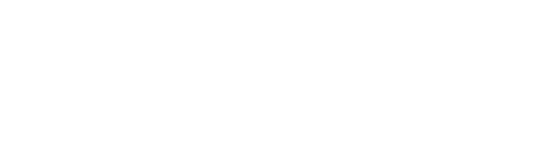

<p align="center">
  
</p>

# Drone Computer Vision


Supervisión aérea de seguridad en obra. Un dron DJI Mini 5 Pro transmite vídeo; el sistema detecta personas y comprueba
si llevan **casco** y **chaleco**. Cuando falta alguno durante un tiempo mínimo, genera una **incidencia con foto**
que una persona revisa después en un dashboard web.

> **Versión beta, solo para pruebas.** El modelo de EPI se entrenó con un dataset público (mAP50 ≈ 0,57) y la vista aérea
> lo degrada. No debe usarse como única base para decisiones de seguridad ni disciplinarias. Ver [Limitaciones](#limitaciones).

## Cómo funciona

```
DJI Mini 5 Pro → RC 2 → DJI Fly (RTMP) → MediaMTX → rtsp://127.0.0.1:8554/drone
                                                          │
                                  ┌───────────────────────┘
                                  ▼
   lector RTSP → detección de personas (YOLO) → tracking (ByteTrack) → EPI por persona
                                                                          │
                                         reglas (duración mínima + cooldown)
                                                                          │
                              SQLite + foto  ──►  Dashboard (FastAPI)  ──►  revisión humana
```

| Módulo | Qué hace |
|---|---|
| `src/stream/rtsp_reader.py` | Hilo que conserva solo el último frame y reconecta si se cae el stream |
| `src/detection/detector.py` | Detección de personas con YOLO |
| `src/tracking/tracker.py` | ByteTrack. Los IDs son temporales y se reinician al reconectar |
| `src/safety/ppe.py` | Asocia casco y chaleco a cada persona y filtra en el tiempo (con / sin / desconocido) |
| `src/safety/rules.py` | Duración mínima y cooldown antes de abrir una incidencia |
| `src/incidents/` | Base de datos SQLite compartida (modo WAL), snapshots y latido del pipeline |
| `src/dashboard/` | API FastAPI y panel web de revisión |

### Criterios de detección
- **"No se detectó casco" no es "sin casco".** Solo cuenta si la zona es visible: persona suficientemente grande,
  sin oclusión y con la cabeza completa. La evidencia explícita (`no_helmet`) pesa más que la inferida.
- El dataset no tiene clase `no_vest`, así que la falta de chaleco **siempre es inferida** y exige más tiempo.
- Una incidencia por persona y momento: si faltan ambos EPI, el tipo es `no_helmet,no_vest`. El cooldown es por (persona, EPI).

## Requisitos
- macOS (probado en Mac Intel x86_64). El servicio del dashboard usa `launchd`.
- **Python 3.12**. En Mac Intel, PyTorch solo publica ruedas hasta 2.2.2, que exige `numpy<2`.
- [MediaMTX](https://github.com/bluenviron/mediamtx) para recibir el RTMP del dron.
- Para vuelo real: DJI Mini 5 Pro con mando RC 2 y la app DJI Fly.

## Instalación
```bash
git clone <url-del-repositorio> drone-safety-ai && cd drone-safety-ai
/usr/local/bin/python3.12 -m venv .venv
source .venv/bin/activate
pip install -r requirements-lock.txt     # versiones exactas (o requirements.txt para relajarlas)
cp .env.example .env                     # opcional: todos los valores son opcionales
```

> Ubica el proyecto **fuera de Escritorio y Documentos** (por ejemplo `~/drone-safety-ai`). macOS bloquea a los procesos
> de `launchd` que leen esas carpetas y el servicio del dashboard se queda colgado.

### Modelos
Los modelos y los datos no se versionan (ver `.gitignore`). Hay que generarlos:

1. Coloca `yolo11n.pt` en `models/` (modelo base de Ultralytics).
2. Entrena el modelo de EPI. Descarga solo el dataset `construction-ppe` en `data/datasets`:
   ```bash
   python scripts/train_ppe.py          # --epochs 30 por defecto; en CPU ≈ 5 min por época
   ```
   El resultado queda en `models/runs/ppe-v1/weights/best.pt`.

## Uso

**Con el dron**
1. Arranca MediaMTX: `mediamtx ~/mediamtx.yml` (path `drone`).
2. En DJI Fly, inicia la transmisión RTMP a `rtmp://<IP-del-Mac>:1935/drone`.
3. Lanza la detección: `python -m src.main --ppe`. La tecla **Q** cierra la ventana.

**Sin dron:** `python -m src.main --webcam --ppe` usa la cámara del Mac.

| Opción | Efecto |
|---|---|
| `--ppe` | Activa la detección de casco y chaleco |
| `--webcam [N]` | Usa la cámara N del Mac (0 por defecto) |
| `--url rtsp://…` | Sobrescribe `RTSP_URL` |
| `--no-window` | Sin ventana, solo logs |
| `--max-seconds N` | Termina tras N segundos (pruebas) |

El pipeline lee el stream por loopback (`rtsp://127.0.0.1:8554/drone`), así que no depende de la IP del router.

### Dashboard
```bash
python -m src.dashboard.app                    # http://127.0.0.1:8000 (solo localhost)
python -m src.dashboard.app --data-dir data_demo --port 8000
```
Una persona revisa cada incidencia: aprueba o descarta, asigna el nombre del trabajador, corrige el tipo, fusiona repeticiones
(y las separa) y consulta la evidencia. Cada cambio queda registrado en la tabla `review_log`. La interfaz es responsiva
y tiene tema claro y oscuro. Se refresca sola cada 4 segundos.

**Siempre encendido (macOS):**
```bash
scripts/dashboard_service.sh install     # arranca al iniciar sesión y se reinicia si se cae
scripts/dashboard_service.sh status | restart | logs | uninstall
```

**Sin dron ni cámara**, con datos de prueba:
```bash
python scripts/seed_demo_incidents.py --data-dir data_demo
python -m src.dashboard.app --data-dir data_demo
```

## Configuración
Se hace con variables de entorno o un archivo `.env` (ver [.env.example](.env.example)). Las más relevantes:

| Variable | Por defecto | Descripción |
|---|---|---|
| `RTSP_URL` | `rtsp://127.0.0.1:8554/drone` | Origen del vídeo |
| `PPE_MODEL_PATH` | `models/runs/ppe-v1/weights/best.pt` | Modelo de EPI |
| `VIOLATION_DURATION_S` | `5.0` | Segundos sin EPI con evidencia explícita antes de abrir incidencia |
| `HELMET_INFERRED_DURATION_S` | `8.0` | Igual, con el casco solo inferido |
| `VEST_INFERRED_DURATION_S` | `10.0` | Igual, para el chaleco (siempre inferido) |
| `INCIDENT_COOLDOWN_S` | `60.0` | Tiempo sin repetir incidencia del mismo tipo para la misma persona |
| `REQUIRE_EXPLICIT_HELMET` | `false` | Si es `true`, exige `no_helmet` explícito (más estricto, menos recall) |
| `SNAPSHOT_RETENTION_DAYS` | `30` | Los snapshots más antiguos se borran al arrancar |

## Privacidad y uso responsable
- **Sin reconocimiento facial.** Es un dato biométrico (RGPD) y el proyecto no lo implementa.
- Los IDs del tracker son temporales. El nombre del trabajador lo asigna **una persona** en el dashboard.
- **Un aviso del sistema no es una sanción.** Toda incidencia requiere revisión humana.
- Los snapshots se purgan a los 30 días. Las incidencias y las fotos (`data/`) **no se versionan**: contienen imágenes de personas.
- El dashboard escucha solo en `127.0.0.1`. No lo expongas a la red sin autenticación.

## Limitaciones
- El modelo de EPI se entrenó con `construction-ppe` de Ultralytics (1.416 imágenes): mAP50 ≈ 0,57. Casco y chaleco rondan 0,83,
  pero `no_helmet` solo alcanza un recall de 0,31.
- Las imágenes del dataset no son aéreas; con el dron el rendimiento baja.
- Sobre un Mac Intel en CPU, la inferencia va a unos 5–8 FPS, y baja mucho si el equipo está saturado.
- Todavía no hay vídeo en directo en el dashboard.

## Hoja de ruta
1. Probar sistemáticamente con el dron real.
2. Recoger y etiquetar frames propios, y reentrenar.
3. Ajustar `HELMET_INFERRED_DURATION_S` y `VEST_INFERRED_DURATION_S` según los falsos positivos.
4. Vídeo en directo en el dashboard.
5. Más adelante: reconocimiento de caras (requiere dataset y revisión legal) y vuelo autónomo, que es un problema aparte.

## Licencias
- **Código del proyecto:** pendiente de definir.
- **Ultralytics (YOLO)** y el dataset **construction-ppe** se distribuyen bajo **AGPL-3.0**. Revisa sus condiciones antes de
  cualquier uso comercial o de distribución del modelo entrenado.

---
<sub>Un proyecto de [Xperimental Media Lab](https://xperimentalmedialab.com) · beta</sub>
